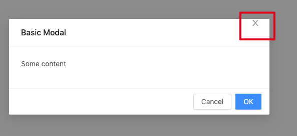
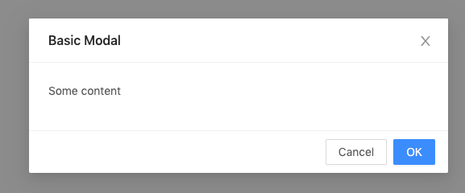

TypeScript React AntDesign Modal Style Issue Demo
=================================

如果在html中顶部没有声明`<!DOCTYPE html>`，则Modal右上角的x位置会有错误（偏上）



添加之后，则正常：



```
npm install
npm run demo
```

It will open page on browser automatically.
